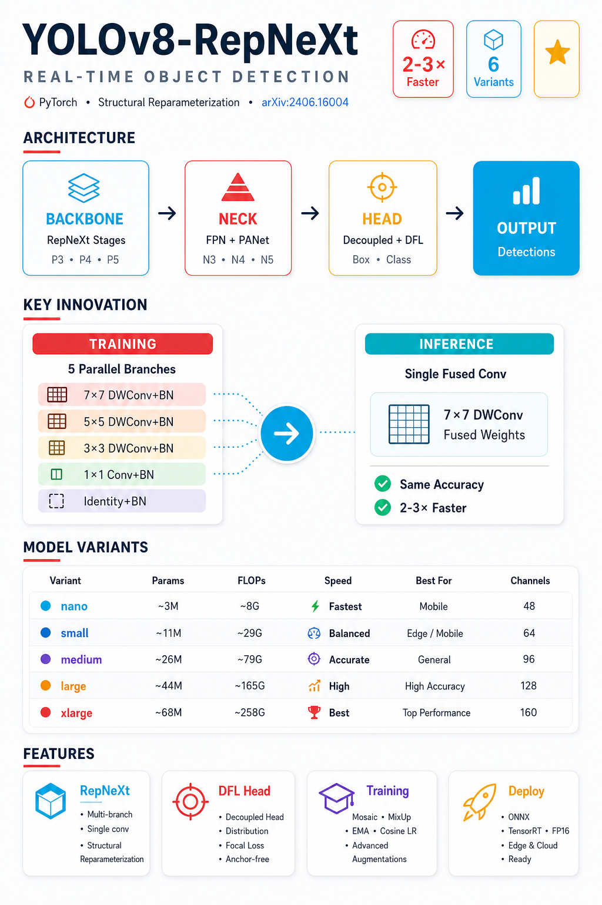
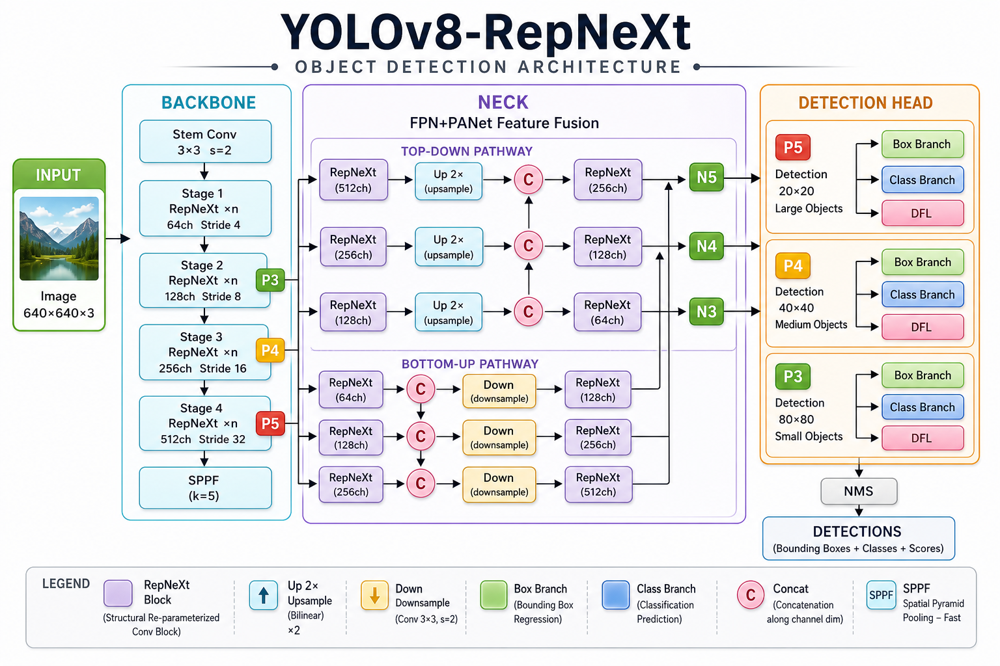
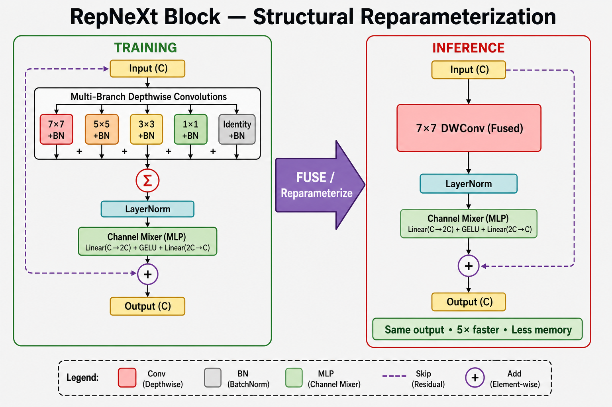
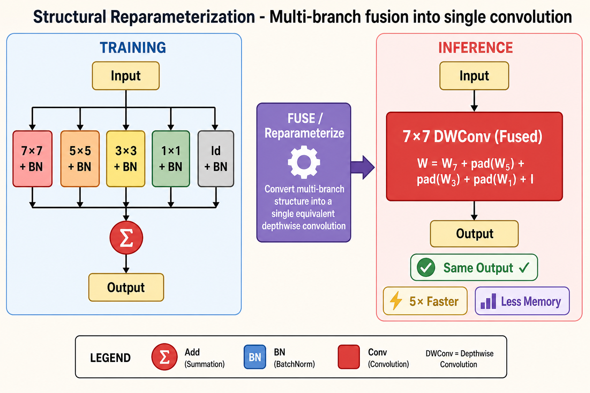
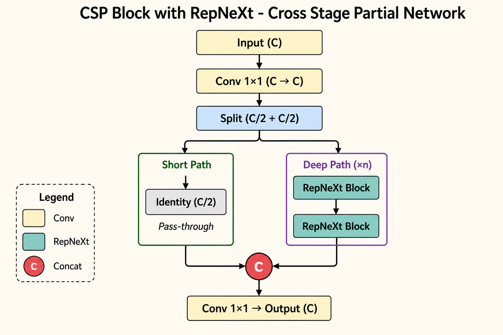

# YOLOv8-RepNeXt

A PyTorch implementation of YOLOv8 that uses [RepNeXt](https://arxiv.org/abs/2406.16004) blocks in the backbone and neck. The goal is straightforward: train a capable detector, then deploy it with fewer layers and less overhead at inference time.



## Why RepNeXt?

RepNeXt uses **structural reparameterization**. During training, each block runs several parallel conv branches (7×7, 5×5, 3×3, 1×1, and identity) so the model can learn from multiple receptive fields. Before deployment, those branches are folded into a single 7×7 convolution.

You keep the richer training-time architecture, but inference looks like a standard efficient CNN.



### RepNeXt block

Training uses multiple branches. Inference uses one fused layer.





### CSP backbone

The backbone uses Cross Stage Partial (CSP) blocks with RepNeXt units for better gradient flow and lower compute cost.



## Quick start

### Requirements

Python 3.8+ and a recent PyTorch build. The project also uses:

```bash
pip install numpy tqdm pyyaml torchvision tensorboard opencv-python
```

If you have a CUDA-capable GPU, install the matching PyTorch build from [pytorch.org](https://pytorch.org).

### Clone and run

```bash
git clone https://github.com/Gaurav14cs17/YOLOv8-RepNeXt.git
cd YOLOv8-RepNeXt
```

A small sample dataset is included under `dataset_mini/`, and `config/config.yml` already points to it. You can train immediately without extra setup.

### Create a model

```python
from model import yolo_v8_n, yolo_v8_s, yolo_v8_m, yolo_v8_l, yolo_v8_x

model = yolo_v8_n(num_classes=80)   # ~2.5M params, fastest
model = yolo_v8_s(num_classes=80)   # ~8M params, good default
model = yolo_v8_m(num_classes=80)   # ~17M params

import torch
x = torch.randn(1, 3, 640, 640)
outputs = model(x)
```

Other variants are available too: `yolo_v8_n_lite`, `yolo_v8_s_lite` (lighter neck), and `yolo_v8_s_bifpn`, `yolo_v8_m_bifpn` (BiFPN neck).

### Speed up inference

Call `reparameterize()` once before running predictions:

```python
model.eval()
model.reparameterize()

with torch.no_grad():
    outputs = model(x)
```

You can also fuse Conv+BN layers with `model.fuse()`.

## Training

Standard training:

```bash
python train.py --train --epochs 100 --batch-size 16 --input-size 640
```

Quantization-aware training (for edge deployment):

```bash
python qtrain.py --train --epochs 20 --batch-size 32
```

Checkpoints are saved to:

- `weights/` — standard training
- `weights_quant/` — quantized training

Most hyperparameters live in `config/config.yml`: learning rate, augmentation, class names, and dataset paths.

### Dataset layout

Use YOLO-format labels:

```
dataset/
├── images/
│   ├── train/
│   └── val/
└── labels/
    ├── train/
    └── val/
```

Each label file has one object per line:

```
class_id x_center y_center width height
```

Coordinates are normalized between 0 and 1. Update the `data:` paths and `names:` section in `config/config.yml` for your dataset.

## Inference

Standard model:

```bash
python inference.py \
    --weights weights/best.pt \
    --source path/to/image.jpg \
    --conf-thres 0.25 \
    --iou-thres 0.45 \
    --save
```

Quantized model:

```bash
python qinference.py \
    --weights weights_quant/best.pt \
    --source path/to/image.jpg \
    --conf-thres 0.25 \
    --save
```

Useful flags: `--show` to display results, `--output` to change the save directory, and `--no-reparam` if you want to skip branch fusion.

## Model variants

| Variant | Approx. params | Notes |
|---------|----------------|-------|
| `yolo_v8_n` | ~2.5M | Best for edge / CPU |
| `yolo_v8_s` | ~8M | Solid default |
| `yolo_v8_m` | ~17M | More accuracy |
| `yolo_v8_l` | ~40M | Higher accuracy |
| `yolo_v8_x` | ~70M | Largest standard model |
| `*_lite` | same backbone | Lighter neck for mobile |
| `*_bifpn` | same backbone | BiFPN neck for stronger fusion |

## Project layout

```
YOLOv8-RepNeXt/
├── model/              # Backbone, neck, head, RepNeXt blocks
├── qmodel/             # Quantized model + pruning helpers
├── dataloader/         # Dataset loading and augmentation
├── utils/              # Losses, metrics, NMS, training helpers
├── config/config.yml   # Training and dataset settings
├── train.py            # Standard training
├── qtrain.py           # Quantization-aware training
├── inference.py        # Standard inference
└── qinference.py       # Quantized inference
```

## What's included

- RepNeXt backbone and neck with structural reparameterization
- YOLOv8-style decoupled head with DFL
- Task-aligned label assignment
- Mosaic augmentation, EMA, mixed precision, and multi-GPU (DDP) support
- Quantization-aware training and model pruning utilities

## Sample output


## References

- [YOLOv1 to YOLOv8](https://arxiv.org/abs/2304.00501) — survey of the YOLO family
- [RepNeXt paper](https://arxiv.org/abs/2406.16004) — structural reparameterization
- [RepNeXt reference code](https://github.com/suous/RepNeXt)

## License

MIT
